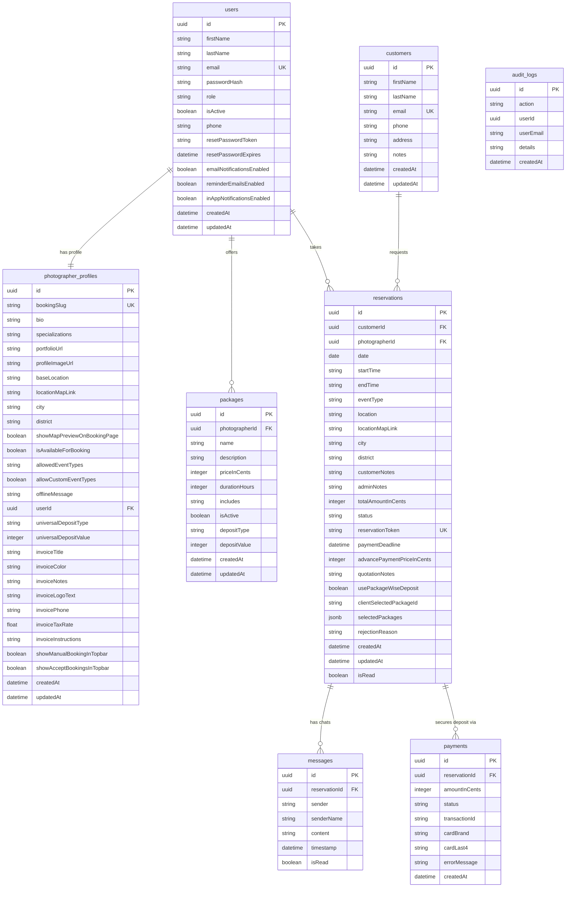

# Photographer Portal - System Architecture Context

This document captures the comprehensive system context and architecture of the **Photographer Portal** application. It serves as a lightweight developer reference to maintain system understanding and reduce token consumption in future LLM sessions.

---

## 1. System Overview & Business Model

The Photographer Portal is a booking and reservation management system designed to connect photographers with their clients, while allowing administrators to manage system-wide assets and performance.

### Key Actor Roles
1. **Public Customers (No Account Required)**:
   - Access public photographer landing pages via custom URLs: `/book/[slug]`.
   - Browse packages, check calendar availability, and submit reservation requests.
   - Track their reservation status, choose proposed packages, chat with the photographer, and make payments using a unique tracking token at `/book/track/[token]`.
2. **Photographers (Authenticated)**:
   - Configure profiles, set geolocation settings (Coordinates, District, City), and set calendar availability constraints.
   - Manage packages (pricing, duration, descriptions).
   - Review incoming reservation requests, propose custom quotes/packages, accept or reject reservations.
   - View visual analytics (earnings, booking counts, location heatmaps/clusters) and download PDF reports.
3. **Admins & Super Admins (Authenticated)**:
   - Create, edit, and deactivate photographer accounts.
   - Update photographer slugs (e.g. changing `alice-clicks` to `alice-photography`).
   - Monitor system-wide performance via leaderboards and comprehensive analytics dashboards.
   - View system-wide action audit logs (`AuditLogsModule`).

---

## 2. Technology Stack & Infrastructure

The application is deployed using a decoupled, service-oriented architecture managed locally via Docker Compose.

| Component | Technology | Role / Configuration |
| :--- | :--- | :--- |
| **Frontend UI** | Next.js 16 (App Router), React 19, Redux Toolkit, Tailwind CSS 4, shadcn/ui | Serves dashboard views and client public flows on **Port 4000** |
| **Backend Core** | NestJS 11, TypeScript, TypeORM | Exposes REST APIs, authentication guards, and event-driven consumers on **Port 4001** |
| **Database** | PostgreSQL 16 | Relational store mapping users, reservations, and audit logs. Exposed on **Port 5433** (Internal **Port 5432**) |
| **Message Broker** | RabbitMQ 3 | Managed queue (`notifications_queue`) for handling asynchronous notifications |
| **SMTP Server** | Maildev | Captures outbound developer emails and exposes a web UI on **Port 1080** |
| **Payment Gateway** | Stripe API | Handles secure credit card payments for reservation deposits |
| **Maps Service** | OpenStreetMap / Leaflet | Enables interactive geocoding and analytics mapping without premium vendor APIs |

---

## 3. Database Schema & Relationships

Entity models are defined using TypeORM in `backend/src/entities/`:

- **User**: Core account model storing credentials, emails, and roles (`SUPER_ADMIN`, `ADMIN`, `PHOTOGRAPHER`).
- **PhotographerProfile**: Extends User for photographers, storing bios, booking slugs, notification preferences (`reminderEmailsEnabled`), and geolocation attributes (coordinates, district, city).
- **Package**: Services offered by photographers containing title, price (stored in cents), description, and duration.
- **Customer**: Dynamic profile containing name, email, and phone, created during booking requests.
- **Reservation**: Connects `PhotographerProfile`, `Customer`, and `Package`. Manages the reservation state machine, event date, tracking token, prices, and event details.
- **Message**: Internal chat records between photographers and customers linked to a specific reservation.
- **Payment**: Financial transactions linked to reservations, tracking payment gateway IDs, status, and whether payment was `stripe` or `offline`.
- **AuditLog**: Independent system action log tracking modifications, user emails, and timestamps for system-wide auditing.

---

## 4. Logical Component Interconnections

```mermaid
graph TD
  %% Style Definitions (MS Visio-like Slate Theme)
  classDef client fill:#E6F2FF,stroke:#0066CC,stroke-dasharray: 0,stroke-width:1.5px,color:#003366;
  classDef web fill:#FFF2CC,stroke:#D6B656,stroke-dasharray: 0,stroke-width:1.5px,color:#665200;
  classDef app fill:#D5E8D4,stroke:#82B366,stroke-dasharray: 0,stroke-width:1.5px,color:#274E13;
  classDef queue fill:#E1D5E7,stroke:#9673A6,stroke-dasharray: 0,stroke-width:1.5px,color:#4C0099;
  classDef db fill:#FFE6CC,stroke:#D79B00,stroke-dasharray: 0,stroke-width:1.5px,color:#7F6000;
  classDef ext fill:#F8CECC,stroke:#B85450,stroke-dasharray: 0,stroke-width:1.5px,color:#660000;

  subgraph Client_Layer ["Client Interfaces"]
    C_Cust["Customer UI<br>(Public Booking/Track)"]:::client
    C_Photo["Photographer UI<br>(Management Dashboard)"]:::client
    C_Admin["Admin UI<br>(System Settings/Audit)"]:::client
  end

  subgraph Frontend_App ["Next.js Frontend (Port 4000)"]
    F_Router["Next.js Router<br>(App Directory)"]:::web
    F_Middleware["Proxy Middleware<br>(Auth Guard)"]:::web
    F_Store["Redux RTK Store<br>(Global State)"]:::web
    
    F_Router --> F_Middleware
    F_Router --> F_Store
  end

  subgraph Backend_App ["NestJS Backend API (Port 4001)"]
    B_Auth["Auth Module<br>(JWT, Passport)"]:::app
    B_Users["Users Module<br>(Photographers & Admins)"]:::app
    B_Photo["Photographers Module<br>(Profiles & Locations)"]:::app
    B_Bookings["Bookings Module<br>(Public Scheduling)"]:::app
    B_Reservations["Reservations Module<br>(State Management)"]:::app
    B_Payments["Payments Module<br>(Stripe / Offline)"]:::app
    B_Reports["Reports Module<br>(PDF Generation & Stats)"]:::app
    B_Audit["Audit Logs Module<br>(Action Tracker)"]:::app
    B_Rabbit["RabbitMQ Module<br>(Global Event Client)"]:::app
    B_Email["Email Module<br>(Worker & Reminders)"]:::app
  end

  subgraph Message_Broker ["Message Queue (Docker)"]
    MQ_RMQ["RabbitMQ Broker<br>(notifications_queue)"]:::queue
  end

  subgraph Data_Storage ["Storage Services (Docker)"]
    DB_Postgres["PostgreSQL Database<br>(Relational Tables)"]:::db
  end

  subgraph External_APIs ["External & Developer Services"]
    API_Stripe["Stripe Gateway<br>(Payment API)"]:::ext
    API_OSM["OpenStreetMap Tile Engine<br>(Leaflet Maps)"]:::ext
    API_Maildev["Maildev SMTP Server<br>(SMTP Port 1025 / Web Port 1080)"]:::ext
  end

  %% Client Connection to Next.js Frontend
  C_Cust -->|Visits /book/[slug] & /book/track| F_Router
  C_Photo -->|Visits /dashboard| F_Router
  C_Admin -->|Visits /dashboard/audit-logs| F_Router

  %% Frontend to Backend REST Interconnections
  F_Middleware -->|Protected REST API Calls| B_Auth
  F_Store -->|CRUD Operations| B_Users
  F_Store -->|Location Updates| B_Photo
  F_Store -->|Submit Request| B_Bookings
  F_Store -->|Manage Booking States| B_Reservations
  F_Store -->|Confirm Payments| B_Payments
  F_Store -->|Fetch Data & Downloads| B_Reports
  F_Store -->|Query Actions| B_Audit

  %% Backend Module DB Interconnections (via TypeORM)
  B_Users -.->|Reads/Writes| DB_Postgres
  B_Photo -.->|Reads/Writes| DB_Postgres
  B_Bookings -.->|Writes Client Details| DB_Postgres
  B_Reservations -.->|Updates Reservation Status| DB_Postgres
  B_Payments -.->|Logs Transactions| DB_Postgres
  B_Reports -.->|Aggregates Booking Stats| DB_Postgres
  B_Audit -.->|Persists System Activity| DB_Postgres
  B_Email -.->|Queries Due Reminders| DB_Postgres

  %% Async Notification & Email Pipeline
  B_Email -->|Publishes Email Payload| B_Rabbit
  B_Rabbit -->|Broker Events| MQ_RMQ
  MQ_RMQ -->|Asynchronous Event Feed| B_Rabbit
  B_Rabbit -->|Invokes Email Worker| B_Email
  B_Email -->|Sends HTML mail via Nodemailer| API_Maildev

  %% External Integrations
  B_Payments -->|Processes Deposits| API_Stripe
  C_Cust -->|Loads Map Markers| API_OSM
  C_Photo -->|Visualizes Map Clusters| API_OSM
  
  %% Link styles
  linkStyle default stroke:#4A5568,stroke-width:1px;
```

---

## 5. Sequence Flows & Module Collaboration

### A. The Reservation Lifecycle Flow
1. **Initiation**: The customer submits a booking request on `BookingsModule`. A `Reservation` record is created in PostgreSQL with `status = PENDING`.
2. **Review & Proposal**: The photographer views the request (`ReservationsModule`) and proposes suitable package options and a custom price. The status transitions to `PROPOSED`, and a Stripe checkout link is compiled.
3. **Asynchronous Notification**: The `EmailModule` sends a prompt message to the customer with their tracking URL. This event is serialized and dispatched via `RabbitMQ` and sent through Maildev.
4. **Acceptance & Deposit**: The customer opens the link, selects a package, and pays the deposit via Stripe (`PaymentsModule`). The webhook transitions the status to `CONFIRMED`.
5. **Post-Event Invoicing**: Once the photo shoot concludes, the photographer requests final payment. The `ReportsModule` compiles the final PDF invoice and dispatches it via email to the client.

### B. Geolocation & Map Display Flow
1. **Input Collection**: When photographers create or update their profile, they click a location on the interactive OpenStreetMap widget (`OSMMapPicker`).
2. **Geographical Geocoding**: The coordinates and user-selected City and District are saved to the `PhotographerProfile` entity in the Postgres database.
3. **Analytics Cluster Aggregation**: When photographers or admins load the reports panel (`LocationAnalyticsSection`), Next.js pulls district aggregated counts from the backend `ReportsModule`.
4. **Rendering**: The `EnhancedLocationMap` renders clustered markers representing reservation locations directly onto Leaflet widgets using OpenStreetMap tile sets.

---

## 6. Entity Relationship (ER) Diagram



---

## 7. SQL DDL for Exact Column Relationships

To draw relationship lines pointing directly to specific columns in **diagrams.net (draw.io)**:
1. Copy the SQL DDL script below.
2. In Draw.io, go to **Arrange** $\rightarrow$ **Insert** $\rightarrow$ **Advanced** $\rightarrow$ **SQL...**
3. Paste the SQL script and click **Insert**.
4. Draw.io will automatically construct standard tables with foreign-key connectors linked **directly to the exact matching columns**.

```sql
CREATE TABLE users (
    id UUID PRIMARY KEY,
    firstName VARCHAR(255),
    lastName VARCHAR(255),
    email VARCHAR(255) UNIQUE,
    passwordHash VARCHAR(255),
    role VARCHAR(50),
    isActive BOOLEAN,
    phone VARCHAR(50),
    resetPasswordToken VARCHAR(255),
    resetPasswordExpires TIMESTAMP,
    emailNotificationsEnabled BOOLEAN,
    reminderEmailsEnabled BOOLEAN,
    inAppNotificationsEnabled BOOLEAN,
    createdAt TIMESTAMP,
    updatedAt TIMESTAMP
);

CREATE TABLE photographer_profiles (
    id UUID PRIMARY KEY,
    bookingSlug VARCHAR(255) UNIQUE,
    bio TEXT,
    specializations TEXT,
    portfolioUrl VARCHAR(255),
    profileImageUrl VARCHAR(255),
    baseLocation VARCHAR(255),
    locationMapLink VARCHAR(255),
    city VARCHAR(255),
    district VARCHAR(255),
    showMapPreviewOnBookingPage BOOLEAN,
    isAvailableForBooking BOOLEAN,
    allowedEventTypes TEXT,
    allowCustomEventTypes BOOLEAN,
    offlineMessage TEXT,
    userId UUID UNIQUE,
    universalDepositType VARCHAR(50),
    universalDepositValue INTEGER,
    invoiceTitle VARCHAR(255),
    invoiceColor VARCHAR(50),
    invoiceNotes TEXT,
    invoiceLogoText VARCHAR(255),
    invoicePhone VARCHAR(50),
    invoiceTaxRate FLOAT,
    invoiceInstructions TEXT,
    showManualBookingInTopbar BOOLEAN,
    showAcceptBookingsInTopbar BOOLEAN,
    createdAt TIMESTAMP,
    updatedAt TIMESTAMP
);

CREATE TABLE customers (
    id UUID PRIMARY KEY,
    firstName VARCHAR(255),
    lastName VARCHAR(255),
    email VARCHAR(255) UNIQUE,
    phone VARCHAR(50),
    address TEXT,
    notes TEXT,
    createdAt TIMESTAMP,
    updatedAt TIMESTAMP
);

CREATE TABLE packages (
    id UUID PRIMARY KEY,
    photographerId UUID,
    name VARCHAR(255),
    description TEXT,
    priceInCents INTEGER,
    durationHours INTEGER,
    includes TEXT,
    isActive BOOLEAN,
    depositType VARCHAR(50),
    depositValue INTEGER,
    createdAt TIMESTAMP,
    updatedAt TIMESTAMP
);

CREATE TABLE reservations (
    id UUID PRIMARY KEY,
    customerId UUID,
    photographerId UUID,
    date DATE,
    startTime VARCHAR(50),
    endTime VARCHAR(50),
    eventType VARCHAR(100),
    location VARCHAR(255),
    locationMapLink VARCHAR(255),
    city VARCHAR(255),
    district VARCHAR(255),
    customerNotes TEXT,
    adminNotes TEXT,
    totalAmountInCents INTEGER,
    status VARCHAR(50),
    reservationToken VARCHAR(255) UNIQUE,
    paymentDeadline TIMESTAMP,
    advancePaymentPriceInCents INTEGER,
    quotationNotes TEXT,
    usePackageWiseDeposit BOOLEAN,
    clientSelectedPackageId UUID,
    selectedPackages TEXT,
    rejectionReason TEXT,
    createdAt TIMESTAMP,
    updatedAt TIMESTAMP,
    isRead BOOLEAN
);

CREATE TABLE messages (
    id UUID PRIMARY KEY,
    reservationId UUID,
    sender VARCHAR(50),
    senderName VARCHAR(255),
    content TEXT,
    timestamp TIMESTAMP,
    isRead BOOLEAN
);

CREATE TABLE payments (
    id UUID PRIMARY KEY,
    reservationId UUID,
    amountInCents INTEGER,
    status VARCHAR(50),
    transactionId VARCHAR(255),
    cardBrand VARCHAR(50),
    cardLast4 VARCHAR(10),
    errorMessage TEXT,
    createdAt TIMESTAMP
);

CREATE TABLE audit_logs (
    id UUID PRIMARY KEY,
    action VARCHAR(255),
    userId UUID,
    userEmail VARCHAR(255),
    details TEXT,
    createdAt TIMESTAMP
);

ALTER TABLE photographer_profiles ADD FOREIGN KEY (userId) REFERENCES users(id);
ALTER TABLE packages ADD FOREIGN KEY (photographerId) REFERENCES users(id);
ALTER TABLE reservations ADD FOREIGN KEY (customerId) REFERENCES customers(id);
ALTER TABLE reservations ADD FOREIGN KEY (photographerId) REFERENCES users(id);
ALTER TABLE messages ADD FOREIGN KEY (reservationId) REFERENCES reservations(id);
ALTER TABLE payments ADD FOREIGN KEY (reservationId) REFERENCES reservations(id);
```

---

## 8. DBML Script for dbdiagram.io (Exact Column Relationships)

To create a visually precise ER diagram with exact column-to-column connecting arrows in **dbdiagram.io**, copy and paste the following DBML script into the left editor panel:

```dbml
Table users {
  id uuid [primary key]
  firstName varchar
  lastName varchar
  email varchar [unique]
  passwordHash varchar
  role varchar
  isActive boolean
  phone varchar
  resetPasswordToken varchar
  resetPasswordExpires timestamp
  emailNotificationsEnabled boolean
  reminderEmailsEnabled boolean
  inAppNotificationsEnabled boolean
  createdAt timestamp
  updatedAt timestamp
}

Table photographer_profiles {
  id uuid [primary key]
  bookingSlug varchar [unique]
  bio text
  specializations text
  portfolioUrl varchar
  profileImageUrl varchar
  baseLocation varchar
  locationMapLink varchar
  city varchar
  district varchar
  showMapPreviewOnBookingPage boolean
  isAvailableForBooking boolean
  allowedEventTypes text
  allowCustomEventTypes boolean
  offlineMessage text
  userId uuid [unique]
  universalDepositType varchar
  universalDepositValue integer
  invoiceTitle varchar
  invoiceColor varchar
  invoiceNotes text
  invoiceLogoText varchar
  invoicePhone varchar
  invoiceTaxRate float
  invoiceInstructions text
  showManualBookingInTopbar boolean
  showAcceptBookingsInTopbar boolean
  createdAt timestamp
  updatedAt timestamp
}

Table customers {
  id uuid [primary key]
  firstName varchar
  lastName varchar
  email varchar [unique]
  phone varchar
  address text
  notes text
  createdAt timestamp
  updatedAt timestamp
}

Table packages {
  id uuid [primary key]
  photographerId uuid
  name varchar
  description text
  priceInCents integer
  durationHours integer
  includes text
  isActive boolean
  depositType varchar
  depositValue integer
  createdAt timestamp
  updatedAt timestamp
}

Table reservations {
  id uuid [primary key]
  customerId uuid
  photographerId uuid
  date date
  startTime varchar
  endTime varchar
  eventType varchar
  location varchar
  locationMapLink varchar
  city varchar
  district varchar
  customerNotes text
  adminNotes text
  totalAmountInCents integer
  status varchar
  reservationToken varchar [unique]
  paymentDeadline timestamp
  advancePaymentPriceInCents integer
  quotationNotes text
  usePackageWiseDeposit boolean
  clientSelectedPackageId uuid
  selectedPackages text
  rejectionReason text
  createdAt timestamp
  updatedAt timestamp
  isRead boolean
}

Table messages {
  id uuid [primary key]
  reservationId uuid
  sender varchar
  senderName varchar
  content text
  timestamp timestamp
  isRead boolean
}

Table payments {
  id uuid [primary key]
  reservationId uuid
  amountInCents integer
  status varchar
  transactionId varchar
  cardBrand varchar
  cardLast4 varchar
  errorMessage text
  createdAt timestamp
}

Table audit_logs {
  id uuid [primary key]
  action varchar
  userId uuid
  userEmail varchar
  details text
  createdAt timestamp
}

// Relationships
Ref: photographer_profiles.userId - users.id
Ref: packages.photographerId > users.id
Ref: reservations.customerId > customers.id
Ref: reservations.photographerId > users.id
Ref: messages.reservationId > reservations.id
Ref: payments.reservationId > reservations.id
Ref: audit_logs.userId > users.id // Visual relation (no strict DB FK)
```
